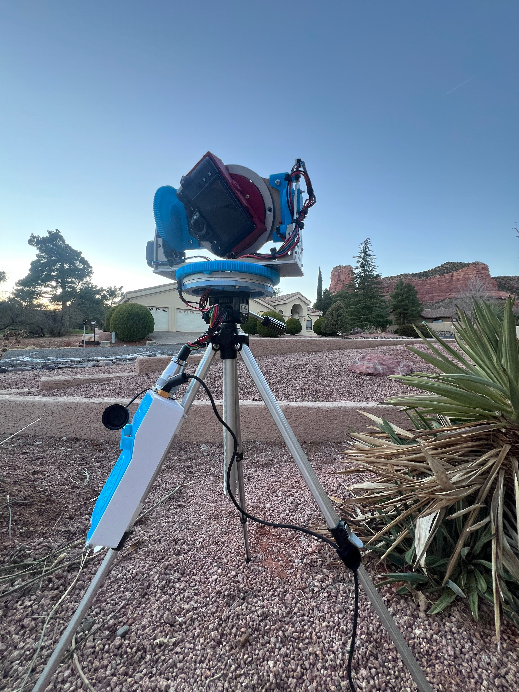
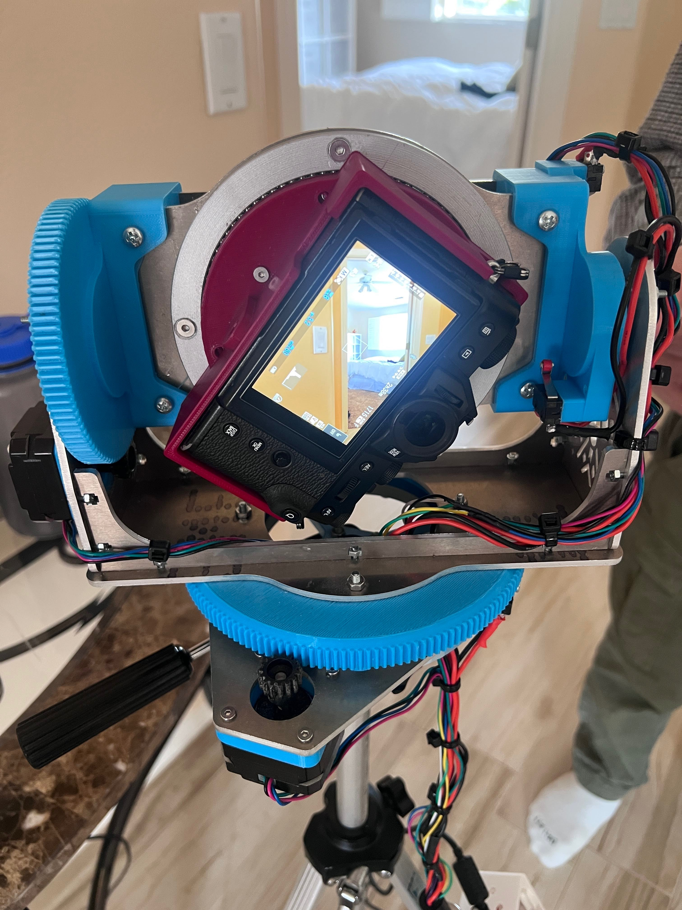
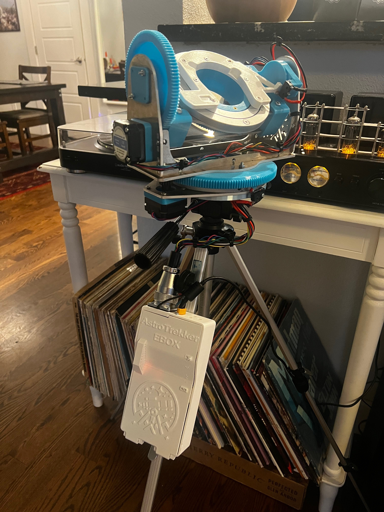

# AstroTrekker

**A backpackable, autonomous robotic gimbal that tracks celestial bodies for astrophotography.**

> IN ACTIVE DEVELOPMENT — FOLLOW FOR UPDATES!

<p align="center">
  
  
  
</p>

## Overview

AstroTrekker is a triple-axis motorized gimbal that autonomously tracks stars, planets, and other celestial bodies in real time. It calculates local altitude/azimuth coordinates using the [Skyfield](https://rhodesmill.org/skyfield/) astronomy library, then drives three stepper motors (turntable, turret, spin) through precision gearing to keep a camera locked on target - all running offline on a Raspberry Pi.

## Features

- **Star Tracking** — Automatically computes and follows the position of any star (via Hipparcos catalog) or planet in real time
- **Triple-Axis Control** — Turntable (360°), turret (180°), and spin (300°) axes with configurable gear ratios and microstepping
- **Web Interface** — On-device Flask + Socket.IO webapp for control from any phone or laptop on the local network
- **Limit Switches** — Hardware limit switches for automatic zeroing and safe motion boundaries
- **Offline Operation** — Runs entirely on embedded hardware with no internet required

## Tech Stack

| Layer | Tech |
|---|---|
| Hardware | Raspberry Pi, NEMA stepper motors, 3D-printed gears & housing, limit switches |
| Backend | Python, Flask, Flask-SocketIO |
| Astronomy | Skyfield (JPL ephemeris, Hipparcos star catalog) |
| Frontend | JavaScript, Socket.IO, JSON Editor |
| Motor Control | RPi.GPIO, microstepping drivers |

## Architecture

```
Web UI (phone/laptop)
  ↓ HTTP / WebSocket
Flask + SocketIO Server
  ↓
StarTrackerService  →  Program (StarTrack, Pan, Circle, etc.)
  ↓
StarTracker  →  Motor (turntable, turret, spin)
  ↓
RPi.GPIO  →  Stepper Drivers  →  Hardware
```

## Getting Started

```bash
# Clone the repo
git clone https://github.com/<your-username>/AstroTrekker.git
cd AstroTrekker

# Install dependencies
pip install -r requirements.txt

# Run
python main.py
```

Connect your phone to the tracker's WiFi Hotspot and control it from the web portal.